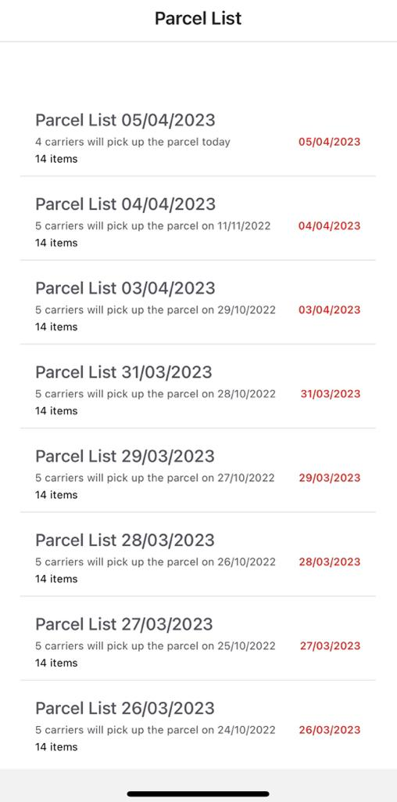
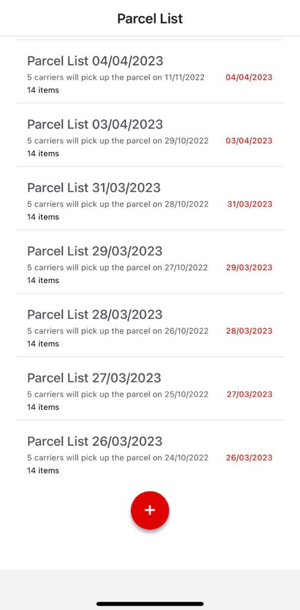
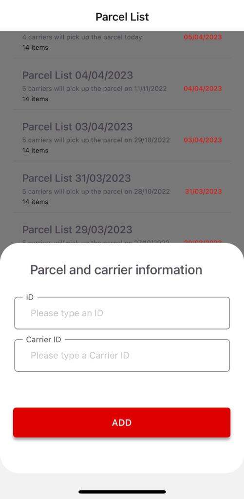
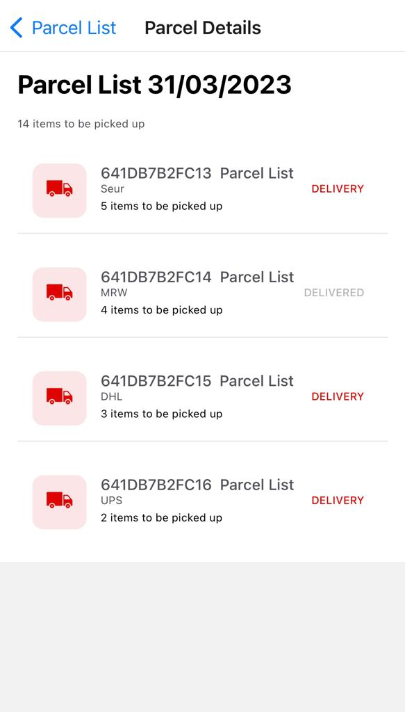

# CarrieX App

CarrieX is a mobile app built in React Native as part of MediaMarkt & Nuwe Hackathon. The Store Staff can choose the right Carrier to deliver the goods at customers home.

## Getting Started

- git clone <https://github.com/DonatellaC/carriex-app-react-native>
- install all project dependencies with `npm install`
- start the development server with `npm start`

## Technologies

- React Native
- React Navigation
- Expo

## To-do

- Improve code

- Add functionality

- Complete screens

- Fix style

- Separate data in lists - utilies
